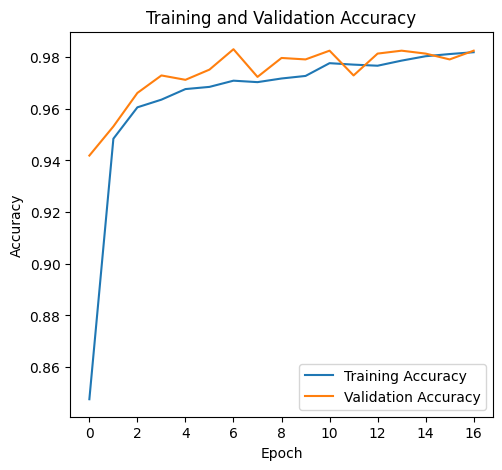

# 🌽 Maize Leaf Disease Multiclass Classification using EfficientNetB4

A deep learning project for classifying maize leaf diseases using transfer learning with EfficientNetB4 architecture.

## 📋 Overview

This project implements a binary classification model to detect diseases in maize (corn) leaves. The model achieves **98.30% validation accuracy** using transfer learning with EfficientNetB4 pre-trained on ImageNet.

## 🏗️ Model Architecture

- **Base Model**: EfficientNetB4 (pre-trained on ImageNet)
- **Input Size**: 380 × 380 × 3
- **Transfer Learning**: Base model frozen during training
- **Custom Layers**: Global Average Pooling + Dense layers with Dropout
- **Total Parameters**: 19.7M (17.7M frozen)

## 📊 Dataset

- **Total Images**: 8,869 images (processed)
- **Training Set**: 80%
- **Validation Set**: 20%
- **Image Processing**: 
  - Aspect ratio preserved
  - Resized to 380×380 with padding
  - Black padding for non-square images

## 🔄 Data Augmentation

The training pipeline includes real-time data augmentation:
- Rotation range: 20°
- Width/Height shift: 20%
- Shear range: 20%
- Zoom range: 20%
- Horizontal flip
- Fill mode: Nearest

## ⚙️ Training Configuration

- **Optimizer**: Adam
- **Loss Function**: Categorical Crossentropy
- **Batch Size**: 64
- **Epochs**: 50 (with early stopping)
- **Early Stopping**: Patience of 10 epochs on validation accuracy
- **Callbacks**: 
  - Model checkpointing (best model)
  - Periodic checkpointing (every 5 epochs)
  - Early stopping

## Performance

### Final Results
- **Validation Accuracy**: 98.30% 🎉
- **Training Accuracy**: 97.09%
- **Best Epoch**: Epoch 7

### Training History
The model showed steady improvement over 17 epochs before early stopping:
- Epoch 1: 94.19% validation accuracy
- Epoch 7: 98.31% validation accuracy (best)
- Early stopping triggered at Epoch 17

## 📦 Requirements

```
tensorflow
keras
numpy
opencv-python (cv2)
matplotlib
seaborn
scikit-learn
```

## 📊 Visualizations

### Training History

#### Accuracy Graph
The model shows excellent convergence with validation accuracy reaching **98.30%**:


*The plot shows consistent improvement in both training and validation accuracy, with early stopping preventing overfitting.*

#### Loss Graph  
Loss curves demonstrate effective learning without overfitting:



*Both training and validation losses decrease steadily, indicating good model generalization.*

### Confusion Matrix

The confusion matrix reveals strong classification performance across all classes:


*The heatmap shows high values along the diagonal, indicating accurate predictions for all disease classes.*

- ✅ **Rapid Convergence**: Model achieves 94%+ accuracy within first epoch
- ✅ **No Overfitting**: Validation metrics closely track training metrics  
- ✅ **Early Stopping**: Training stopped at epoch 17, best model from epoch 7
- ✅ **Balanced Performance**: Confusion matrix shows good performance across all classes
- ✅ **Minimal False Positives**: Very few misclassifications in the confusion matrix

---

## 📧 Contact & Connect

I'd love to hear from you! Feel free to reach out for collaborations, questions, or just to connect!

### 👤 Author
**JAYRAJSINH GOHIL**  
*AI/ML Student | Deep Learning Enthusiast*

### 🔗 Connect with me:

<div align="left">

[](https://www.linkedin.com/in/gohil-jayrajsinh/)

[](https://github.com/Jayrajsinh-Gohil)

[](mailto:gohiljayraj8383@gmail.com)

</div>

---

<div align="center">

###  If you found this project helpful, please consider giving it a star! ⭐

**Made with ❤️ and 🤖 by JAYRAJSINH GOHIL**

*Last Updated: February 2026*

</div>
